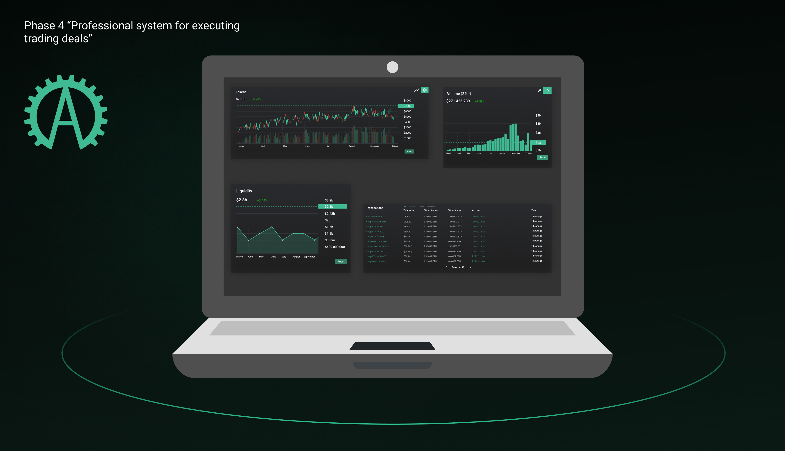

# Argano DEX

The Argano protocol is not a short-lived project with yield generation, powered by simple liquidity mining without a constructive foundation and straight vision. Starting from the simple, the Argano protocol is bound to grow into the bigger.

**Goal №1** - a fully featured decentralized exchange as a competitor to the old centralized ones: a multifunctional management system, offering trading instruments, while demanding no time-consuming KYC procedures. The main zest of the idea is total decentralization, the level to which has never been met in exchanges currently available on the market.

The described goal will be achieved through a system of phases described below. The ‘step-by-step’ roll-out of the idea will allow us to correct directions as we go, taking into account market conditions, and the community feedback.

## **Phase 1 “Liquidity accumulation and token distribution”**

* Capturing community interest in our algorithmic side of the protocol by rewarding early investors for contributing to the development of the project. Identification of key executives, early investors, active community members, and other governance token holders for the creation of the DAO structure.
* Ensuring the necessary level of liquidity to maintain the viability of the synthetic, partially collateralized Argano native tokens AGOUSD / AGOBTC.
* Stabilization of the level of liquidity maintenance, token prices, and the parallel development of a decentralized exchange.

## **Phase 2 “Primary DEX functionality”**

* Creation Argano DEX using native AMM structure and DEX smart contracts development.
* Ensuring a sufficient level of liquidity and introducing primary functionality of the future full-featured trading platform.

## **Phase 3 “Implementation of the key trading tools”**

* At the beta launch, implementing basic SPOT functionality is obviously the easiest step that can be reached for subsequent development and reaching our next milestones
* Gradual implementation of trading pairs based on the DAO Governance voting results within AGO token holders.
* Development of the Leverage tokens to ensure Margin trades. Margin trading and Futures trading functionality creation with the gradual testing and implementation.

## **Phase 4 “Multi-chain protocol and market scalability”**

* Construction and pegging other synthetic collateralized tokens from different chains. Implementation of their further Argano DEX trading.
* Today's realities tell us that the world is not limited in anything, and blockchain power as well. We are aiming to create hundreds of synthetic tokens from different market areas only emphasizing for us the priority of subsequent actions with the help of the DAO Governance voting results. Scalability + Scalability => Multi Scalability. The stock market in the DeFi space will be a reality.
* Accumulation of ideas, development, and creation of Insurance Fund against unforeseen cases of unstable network operation, hacker attacks, hacking, and other similar scenarios.
* Upbuilding marketing resources for the worldwide scalability program. Workflow on the creation of DEX tools, applications for stationary and mobile devices. Modification of the difficulty level of the entrance threshold for the new audience of the DeFi market. Gamification and simplicity.

## **Phase 5 “Professional system for executing trading deals”**

* Our platform will allow customers to perform professional decisions thanks to the expanded trading system with the ability to place orders of any type. The trader will not be squeezed within the limited functionality, he will have access to a multifunctional management system, which includes placing trade orders: not only stop orders but also take profit orders. A system for setting volumes for a deal will also be implemented, designed interface in a clear and accessible way.
* Platform participants will be provided with the open-source code to connect through third-party services using API keys. Thus, we will be able to attract most of the professional users to our resources. In addition, the function of binding several accounts at once to follow and copy transactions will be also available. This option will expand the functionality of interaction with the exchange.

