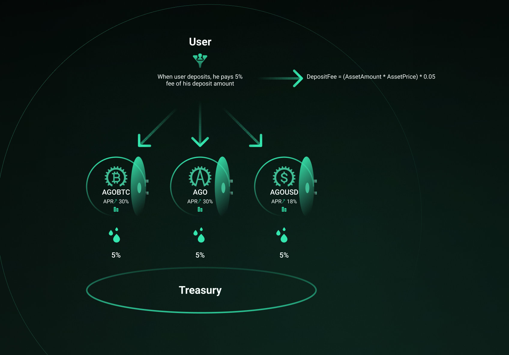

# Staking rewards & Liquidity mining

Argano token distribution events based on the traditional terms of providing liquidity will be available after the pre-sale stage. The following options will ensure circulation supply with the AGO token, increase trading volume and bring a remarkably high annual percentage rate of the returns for the participants. Let’s have a more clear picture concerning these events.

### **In the beginning, the staking program will be divided into 3 vaults and each one will have specific distinctions:**

* **AGOBTC vault** _Reward pool size - 2,600,000 AGO \(10%\) Deposit fee - 5%_

1. Only AGOBTC is accepted for staking.
2. Get your AGOBTC by purchasing minting new tokens on the corresponding page.
3. Stake your freshly received AGOBTC tokens into the vault with the fixed return - _**30% APR**_.
4. Claim your AGO rewards anytime.

* **AGOUSD vault** _Reward pool size - 2,600,000 AGO \(10%\) Deposit fee - 5%_

1. Only AGOUSD  is accepted for staking.
2. Get your AGOUSD by purchasing or minting new tokens on the corresponding page.
3. Stake your freshly received AGOUSD tokens into the vault with the fixed return - _**18% APR**._
4. Claim your AGO rewards anytime.

* **AGO vault** _Reward pool size - 5,200,000 AGO \(5%\) Deposit fee - 5%_

1. Only AGO itself is accepted for staking.
2. Get your AGO by purchasing on the trading page or use your tokens from the pre-sale event.
3. Stake your freshly received AGO tokens into the vault with the fixed return - _**30% APR**_.
4. Claim your AGO rewards anytime.


**Funds lock period applies only to the single token staking in the vault smart contracts. The period is equal to 90 days. After the mentioned time, you will be eligible to withdraw your deposit.**



The deposit fee will be accumulated in the treasury contract and will have a certain appointment. See AGO Buyback & burning.


At the fair launch, Argano DEX will use Uniswap as an automated market maker. AMM smart contracts work on the well-known mathematical formula:

$$
x * y = k
$$

where x - the amount of one token in the liquidity pool, y - the amount of another token, k is a constant, which equals the total liquidity of the pool.

To become a liquidity provider, users should keep the asset price ratio 50% / 50% and have 2 tokens in their wallets that will be used in the following pool:

* **AGO / WETH** 

_The total reward pool size - 18,200,000 AGO \(35%\)_

For participating in a liquidity program and maintaining the trading volume, liquidity providers will be rewarded by the AGO governance token and a part of the trading fees. This fee \(0.3%\) is paid by traders who interact with the liquidity pools and make token swaps.  

