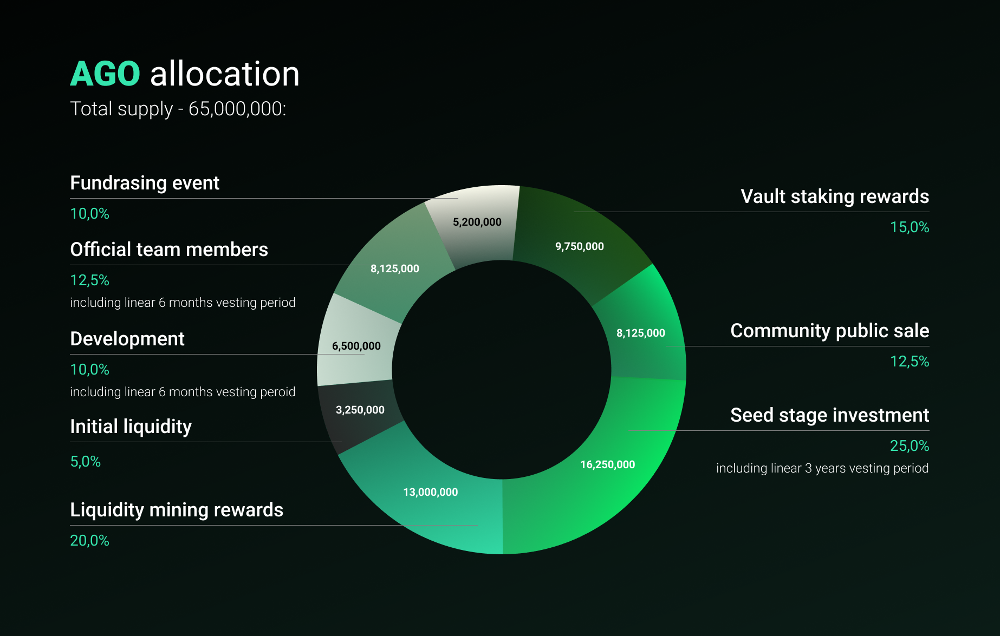

# Tokenomics

## **“Agonomics”**

**Initial and further distribution**

### $AGO total supply - `65,000,000`:

* Vault staking rewards - 9,750,000 \(15%\)
* Liquidity mining rewards - 13,000,000 \(20%\)
* Initial liquidity - 3,250,000 \(5%\)
* Development - 6,500,000 \(10%\) including linear 6 months vesting peroid
* Official team members - 8,125,000 \(12.5%\) including linear 6 months vesting period
* Community public sale event - 8,125,000 \(12.5%\)
* Seed stage investment - 16,250,000 \(25%\) including linear 3 years vesting period

